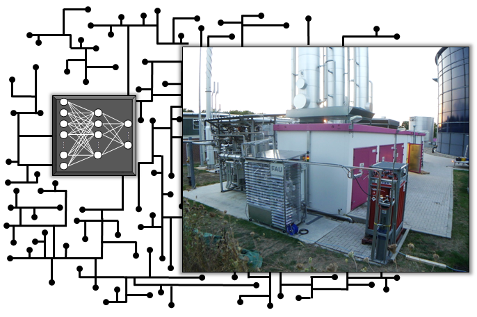
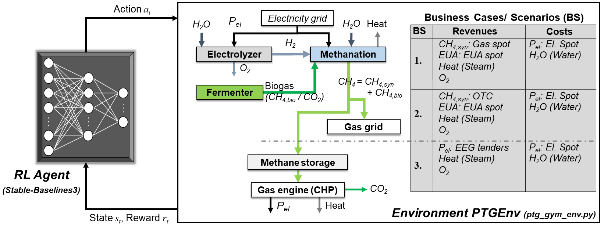
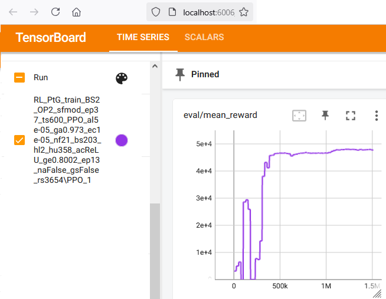
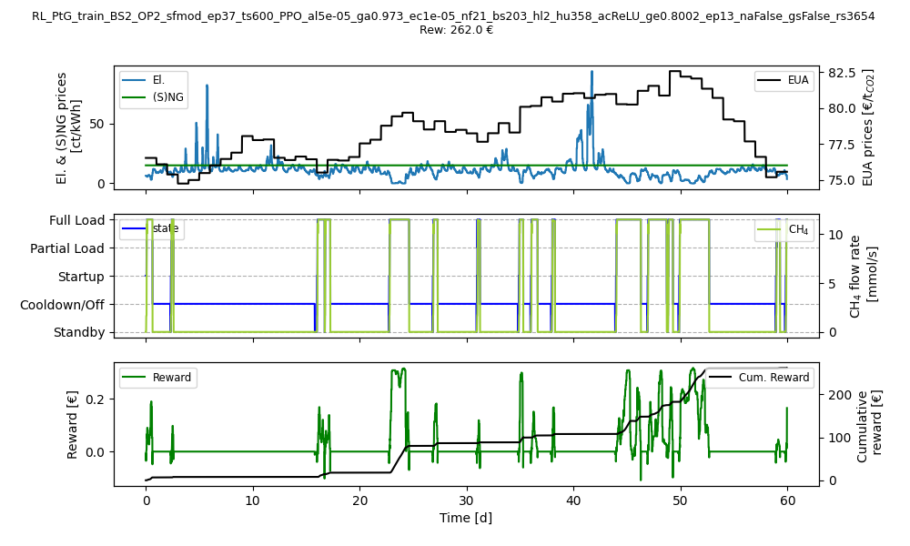

# RL_PtG

The **RL_PtG** project provides a framework for the economic optimization of Power-to-Gas (PtG) dispatch using Deep Reinforcement Learning (RL). PtG is a technology that enables the chemical energy storage of renewable energy in chemical energy carriers such as hydrogen (H<sub>2</sub>) or methane (CH<sub>4</sub>). **RL_PtG** facilitates the training of state-of-the-art deep RL algorithms for the optimal control of PtG plants, based on process data and Day-ahead electricity, natural gas, and emissions spot market data.  

This repository contains the source code for the **RL_PtG** framework, which has been successfully demonstrated for the autonomous control of a real-world PtG pilot plant in Northern Germany [1].  



*Figure 1: Utilization of deep Reinforcement Learning for dispatch optimization of a real-world Power-to-Gas plant.*

---

## Table of Contents

1. [Overview](#overview)
2. [Project structure](#project-structure)
3. [Installation and Usage](#installation-and-usage)
4. [License](#license)
5. [Citing](#citing)
6. [References](#references)
7. [Acknowledgments](#acknowledgments)

---

## Overview

**RL_PtG** is written in Python and includes a data-driven process model of a real-world PtG plant. This section provides an in-depth explanation of the application and details the algorithms used, the data preprocessing, and the feature design.  

### Application

The PtG process typically begins with water electrolysis, where an electric current is used to split water (H<sub>2</sub>O) into hydrogen and oxygen (O<sub>2</sub>). **RL_PtG** assumes a proton exchange membrane (PEM) electrolyzer with a load-dependent efficiency modeled after a commercial system [2]. The efficiency has been derived using experimental data and linear regression with nonlinear basis functions [3].  

In addition to PEM electrolysis, **RL_PtG** incorporates a chemical methanation unit that converts hydrogen and carbon dioxide (CO<sub>2</sub>) into methane. Since biogas contains a significant amount of CO₂ (up to 55%), this process utilizes biogas as a carbon source. To accurately model the methanation unit's process dynamics—which dominate the overall PtG system dynamics—the approach integrates a time-series process model based on experimental data from a real-world pilot plant.  

The experimental data captures plant behavior during startup, load changes, cooldown, and standby operations of the methanation unit. In standby mode, the reactor temperature is maintained at approximately 190°C to enable a rapid warm startup. The data-driven process model switches between different time-series datasets to simulate dynamic plant operations. This approach is both simple and highly accurate and provides that the plant operates consistently and predictably [3].  

Figure 2 illustrates the current PtG process, where the produced CH<sub>4</sub> can either be injected into the natural gas grid or used in a gas engine for combined heat and power (CHP) generation. The various methods of processing and selling CH<sub>4</sub> define three distinct business scenarios (BS) within this application:  

- **BS1**: Trades CH<sub>4</sub> on the natural gas spot market.  
- **BS2**: Sells CH<sub>4</sub> to a bilateral partner via Over-the-Counter (OTC) contracts.  
- **BS3**: Integrates a CHP plant and sells the generated electrical power (*P<sub>el</sub>*) through special tenders under the German Renewable Energy Act (EEG).  

Additional revenue sources include heat, oxygen, and European Emission Allowances (EUA). Since BS1 and BS2 bind CO₂ in methane, they can generate revenue by selling EUAs through the European Emissions Trading System (EU-ETS). The primary operational costs of the process include electricity and water, with electricity being purchased from the German Day-ahead spot market.  

**RL_PtG** integrates historical electricity market data from `data/spot_market_data/`, sourced from SMARD [4]. The original research and RL training in [1,3] also utilized historical market data for gas and EUA from MONTEL [5]. However, due to licensing restrictions, the present repository only includes synthesized datasets that replicate the statistical properties and non-linear characteristics of the original data.  

The **RL_PtG** framework models the complete PtG process, including PEM electrolysis, chemical methanation, and energy market data, within the **PtGEnv** environment (*Gymnasium* framework). For an overview of the project's directories and files, refer to the [Project Structure](#project-structure) section.  



*Figure 2: Optimization framework for Power-to-Gas dispatch using Reinforcement Learning agents and the PtGEnv environment including the different business cases.*

### Deep RL Algorithms  

Deep reinforcement learning (RL) offers a promising approach for optimizing the economic operation of chemical plants, handling both the **non-linearity** and **stochasticity** of process dynamics and market behavior. 

For deep RL, **RL_PtG** integrates the *Stable-Baselines3* and *SB3 Contrib* libraries, which provide implementations of various state-of-the-art deep RL algorithms. This project includes the following algorithms from these libraries:  

**DQN** [6], **A2C** [7], **PPO** [8], **TD3** [9], **SAC** [10], and **TQC** [11]  

For detailed information on these implementations, refer to:  

- **Stable-Baselines3:** [https://stable-baselines3.readthedocs.io/en/master/guide/algos.html](https://stable-baselines3.readthedocs.io/en/master/guide/algos.html)  
- **SB3 Contrib:** [https://sb3-contrib.readthedocs.io/en/master/](https://sb3-contrib.readthedocs.io/en/master/)  

Algorithm configurations for training runs can be set in `config/config_agent.yaml`. 

If you wish to add a new algorithm from *Stable-Baselines3* or *SB3 Contrib*, you must modify the following files accordingly:  

- `config/config_agent.yaml`  
- `src/rl_config_agent.py`  

Use the existing implementations as a reference when making adjustments.  

### Data Preprocessing and Feature Design  

During the development of **RL_PtG**, two different state feature design approaches were explored for PtG dispatch optimization. These can be configured in `config/config_env.yaml`.

The type of state feature design is controlled via the `raw_modified` parameter:  

- `raw`: The environment provides the RL agent with raw Day-ahead market prices for electricity, gas, and EUA.  
- `mod`: The environment precomputes a *potential reward* and a *load identifier* for the corresponding Day-ahead period (default: 0-12 hours).  

In `mod`, the environment calculates the potential reward assuming steady-state operation under three conditions (*Partial load*, *Full load*, and *Cooldown*) for the selected Day-ahead period.

The potential reward represents the maximum achievable reward in steady-state operation under the current market conditions in one of these conditions. However, it does not indicate which load level is the most beneficial.  

To address this, the load identifier classifies the most profitable operation type:  

| Load Condition  | Identifier Value |
|----------------|-----------------|
| *Cooldown*   | -1              |
| *Partial Load* | 0              |
| *Full Load*   | 1              |

Together, the potential reward and load identifier provide insights into the most beneficial operating mode and its expected profitability. However, this approach does not account for plant dynamics, meaning real-world transitions between states may still impact performance.  

---

## Project Structure

The project is organized into the following directories and files:

```plaintext
RL_PtG/
│
├── config/
│   ├── config_agent.yaml
│   ├── config_env.yaml
│   └── config_train.yaml
│
├── data/
│   ├── OP1/
│   ├── OP2/
│   └── spot_market_data/
│
├── env/
│   └── ptg_gym_env.py
│
├── logs/
│
├── plots/
│
├── src/
│   ├── rl_config_agent.py
│   ├── rl_config_env.py
│   ├── rl_config_train.py
│   ├── rl_opt.py
│   └── rl_utils.py
│
├── tensorboard/
│
├── requirements.txt
├── rl_main.py
└── rl_tb.py

```

### `config/`  
Contains configuration files for the project:  
- **`config/config_agent.yaml`**: Configuration for the RL agent.  
- **`config/config_env.yaml`**: Configuration for the PtG environment.  
- **`config/config_train.yaml`**: Configuration for the training procedure.  

### `data/`
Stores process data for two load levels (**OP1** and **OP2**) with different dynamics, along with energy market data:  
- **`data/OP.../data-meth_cooldown.csv`**: Cold startup data.
- **`data/OP.../data-meth_op1_start_p.csv`**: Partial load after startup.
- **`data/OP.../data-meth_op2_start_f.csv`**: Full load after startup.
- **`data/OP.../data-meth_op3_p_f.csv`**: Partial to full load transition.
- **`data/OP.../data-meth_op4_p_f_p_5.csv`**: Partial to full load and back after 5 min.
- **`data/OP.../data-meth_op5_p_f_p_10.csv`**: Partial to full load and back after 10 min.
- **`data/OP.../data-meth_op6_p_f_p_15.csv`**: Partial to full load and back after 15 min.
- **`data/OP.../data-meth_op7_p_f_p_20.csv`**: Partial to full load and back after 20 min.
- **`data/OP.../data-meth_op8_f_p.csv`**: Full to partial load transition.
- **`data/OP.../data-meth_op9_f_p_f_5.csv`**: Full to partial load and back after 5 min.
- **`data/OP.../data-meth_op10_f_p_f_10.csv`**: Full to partial load and back after 10 min.
- **`data/OP.../data-meth_op11_f_p_f_15.csv`**: Full to partial load and back after 15 min.
- **`data/OP.../data-meth_op12_f_p_f_20.csv`**: Full to partial load and back after 20 min.
- **`data/OP.../data-meth_standby_down.csv`**: From operation to standby.
- **`data/OP.../data-meth_standby_up.csv`**: # From idle state to standby.
- **`data/OP.../data-meth_startup_cold.csv`**: Cold startup data.
- **`data/OP.../data-meth_startup_hot.csv`**: Warm startup data.
- **`data/OP.../data-meth_cooldown.csv`**: Cooldown data.
- **`data/spot_market_data/data-day-ahead-el-test.csv`**: Day-ahead electricity spot market data for testing.
- **`data/spot_market_data/data-day-ahead-el-train.csv`**: Day-ahead electricity spot market data for training.
- **`data/spot_market_data/data-day-ahead-el-val.csv`**: Day-ahead electricity spot market data for validation.
- **`data/spot_market_data/data-day-ahead-eua-test.csv`**: Day-ahead EUA spot market data for testing.
- **`data/spot_market_data/data-day-ahead-eua-train.csv`**: Day-ahead EUA spot market data for training.
- **`data/spot_market_data/data-day-ahead-eua-val.csv`**: Day-ahead EUA spot market data for validation.
- **`data/spot_market_data/data-day-ahead-gas-test.csv`**: Day-ahead gas spot market data for testing.
- **`data/spot_market_data/data-day-ahead-gas-train.csv`**: Day-ahead gas spot market data for training.
- **`data/spot_market_data/data-day-ahead-gas-val.csv`**: Day-ahead gas spot market data for validation.

### `env/`
Contains the PtG environment, modeled as a *Gymnasium* class: 
- **`env/ptg_gym_env.py`**: Power-to-Gas environment implementation.

### `logs/`
Stores training logs. RL_PtG saves the best-performing RL algorithm and its parameters during validation.  

### `plots/`
After training, RL_PtG evaluates the best RL policy on the test set and generates a performance diagram.

### `src/`
Contains source code for pre- and postprocessing:
- **`src/rl_config_agent.py`**: Preprocesses agent settings.
  - `AgentConfiguration()`: Agent class.
    - `set_model()`: Initializes a Stable-Baselines3/SB3 Contrib model.
    - `load_model()`: Loads a pretrained RL model.
    - `save_model()`: Saves the trained model and replay buffer (if applicable).
    - `get_hyper()`: Displays hyperparameters and generates an identifier string using `hyp_print()`. 
    - `hyp_print()`: Prints and appends hyperparameter values to the identifier.
- **`src/rl_config_env.py`**: Preprocesses environment settings.
  - `EnvConfiguration()`: Environment class.
- **`src/rl_config_train.py`**: Preprocesses training settings.
  - `TrainConfiguration()`: Training class.
- **`src/rl_opt.py`**: Computes the theoretical optimum T-OPT ignoring plant dynamics.
  - `calculate_optimum()`: Computes the potential rewards, the load identifiers, and the theoretical optimum T-OPT assuming no operational constraints.          
- **`src/rl_utils.py`**: Contains utility and helper functions.
  - `import_market_data()`: Loads Day-ahead market price data.
  - `import_data()`: Imports experimental methanation process data.
  - `load_data()`: Loads historical market and process data using `import_market_data()` and `import_data()`.
  - `Preprocessing()`: Preprocessing class.
    - `preprocessing_rew()`: Computes potential rewards using `calculate_optimum()`.
    - `preprocessing_array()`: Converts dictionaries into NumPy arrays.
    - `define_episodes()`: Defines training and evaluation episodes using `rand_eps_ind()`.
    - `rand_eps_ind()`: Selects random subsets of training data.
    - `dict_env_kwargs()`: Stores global parameters and hyperparameters in a dictionary.
    - `initial_print()`: Displays startup information.
    - `config_print()`: Prints general configuration settings.
    - `_make_env()`: Creates and normalizes Gymnasium environments.
    - `eval_callback_dec()`: Decorator function for evaluation callbacks.
    - `_make_eval_env()`: Creates an evaluation environment using `_make_env()` and `eval_callback_dec()`.
    - `create_vec_envs()`: Generates vectorized environments for training, validation, and testing using `_make_eval_env()` and `_make_env()`.
  - `Postprocessing()`: Postprocessing class.
    - `test_performance()`: Evaluates the RL policy in the test environment.
    - `plot_results()`: Generates performance plots.

### `tensorboard/`
Stores *TensorBoard logs* for monitoring RL training progress.

### **Main Script**  
- **`rl_main.py`** – The main script for training the RL agent on the PtG dispatch task.  
  - `computational_resources()` – Configures computational settings.  
  - `check_env()` – Registers the Gymnasium environment if not already present.  
  - `main()` – Runs model training and evaluation.  

### **Miscellaneous**  
- **`rl_tb.py`** – Starts a TensorBoard server for monitoring training progress.  
- **`requirements.txt`** – Lists required Python libraries.

---

## Installation and Usage

**Note:** Python **3.10** or newer is required to run the code. 

### Using a virtual environment

To run **RL_PtG** in a Python virtual environment, follow these steps to install and run the project:

```bash
# Clone the repository
git clone https://github.com/SimMarkt/RL_PtG.git

# Navigate to the project directory
cd RL_PtG

# Create a Python virtual environment
python -m venv venv

# Activate the virtual environment
.\venv\Scripts\activate

# Install the required python libraries
pip install -r requirements.txt

```

After setting up the Python environment and installing the necessary packages, you can adjust the environment, agent, and training configurations by modifying the YAML files in the `config/` directory. RL training is initiated by running the main script `rl_main.py`.  

### Using a Docker container

To run **RL_PtG** as a Docker container, follow these steps to install and run the project:

```bash
# Clone the repository
git clone https://github.com/SimMarkt/RL_PtG.git

# Navigate to the project directory
cd RL_PtG

# Build the Docker container using the 'Dockerfile'
docker build -t rl-ptg:v1 .

# Verify that the image was created successfully
docker images

>>
REPOSITORY    TAG       IMAGE ID       CREATED         SIZE
rl-ptg        v1        ...            3 minutes ago   5.87GB
>>

# Run the container
docker run --rm -it rl-ptg:v1

```

If you need to adjust the environment, agent, or training configurations, you can modify the YAML files located in the `config/` directory. After making these changes, rebuild the Docker image to apply them in the container (you can also optionally update the tag):

```bash
# Rebuild the Docker image using the 'Dockerfile'
docker build -t rl-ptg:v1 .

# Verify that the image was created successfully
docker images

>>
REPOSITORY    TAG       IMAGE ID       CREATED         SIZE
rl-ptg        v1        ...            1 minutes ago   5.87GB
>>

# Run the container
docker run --rm -it rl-ptg:v1

```

Please note that training the RL agents can be resource-intensive, especially if you're performing extensive hyperparameter optimization or conducting in-depth analysis using multiple random seeds. In such cases, it's recommended to avoid using the Docker container and instead set up a Python virtual environment (as described above) for better performance.

### Monitoring

During training, the RL model is periodically evaluated on the validation environment using new, unseen energy market data:  
- The best-performing algorithm is automatically saved in the `logs/` directory. 
- Training results, including cumulative rewards on the training and validation sets, as well as algorithm-specific properties, are logged in *TensorBoard* (`tensorboard/`).  

To monitor the training and evaluation results, start the **TensorBoard server**:

```bash
python rl_tb.py
```

Then, open TensorBoard in your browser: http://localhost:6006/

Figure 3 illustrates a learning curve for a PPO algorithm trained on the PtG dispatch optimization task.



*Figure 3: Graphical user interface of the tensorboard server for RL monitoring with a learning curve of PPO on the validation environment.*

After RL training, RL_PtG selects the best-performing algorithm from `logs/` and evaluates its performance on the *test environment* to assess its generalization capability. The results are visualized and stored in `plots/` (Fig. 4).  



*Figure 4: PPO performance on the test environment including energy market data, PtG process state, methane production, reward, and cumulative reward.*

The file name and title indicate the applied settings:  

| Parameter | Description |  
|-----------|------------|  
| **Business Scenario (BS)** | Scenario defining the operational and economic conditions |  
| **Load Level (OP)** | Operating load level for PtG dispatch |  
| **State Feature Design (sf)** | Feature engineering method used for state representation |  
| **Training Episode Length (ep)** | Number of time steps per training episode |  
| **Time-Step Size (ts)** | Duration of a single time step in the simulation |  
| **Algorithm (al)** | Deep RL algorithm used |  
| **Discount Factor (ga)** | Discount rate for future rewards |  
| **Initial Exploration Coefficient (ie)** | Initial value for exploration-exploitation tradeoff |  
| **Final Exploration Coefficient (fe)** | Final value for exploration-exploitation tradeoff |  
| **Exploration Ratio (re)** | Ratio of steps spent in exploration mode |  
| **Entropy Coefficient (ec)** | Weighting factor for entropy in policy learning |  
| **Exploration Noise (en)** | Noise applied during action exploration in TD3 |  
| **N-Step TD Update (ns)** | Number of steps for n-step temporal difference updates |  
| **N-Step Factor (nf)** | Factor for n-step learning |  
| **Replay Buffer Size (rb)** | Capacity of the replay memory buffer |  
| **Batch Size (bs)** | Number of samples used in each training batch |  
| **No. of Hidden Layers (hl)** | Number of hidden layers in the neural network |  
| **No. of Hidden Units (hu)** | Number of neurons per hidden layer |  
| **Activation Function (ac)** | Activation function used in the neural network |  
| **Generalized Advantage Estimation (ge)** | GAE parameter for advantage computation |  
| **No. of Epochs (ep)** | Number of training epochs |  
| **Normalize Advantage (na)** | Whether the advantage function is normalized |  
| **No. of Quantiles (nq)** | Number of quantiles used in distributional RL |  
| **No. of Dropped Quantiles (dq)** | Number of quantiles dropped in TQC algorithm |  
| **No. of Critics (cr)** | Number of critic networks in actor-critic methods |  
| **Soft Update Parameter (ta)** | τ parameter for soft target updates |  
| **Learning Starts (ls)** | Number of steps before training begins |  
| **Training Frequency (tf)** | Frequency of model updates |  
| **Target Update Interval (tu)** | Interval for updating the target network |  
| **gSDE Exploration (gs)** | Whether generalized State-Dependent Exploration (gSDE) is used |  


---

## Requirements

- Python 3.10+
- Required libraries:
  - `matplotlib`
  - `gymnasium`
  - `pandas`
  - `stable-baselines3`
  - `sb3-contrib`
  - `tensorboard`
  - `tqdm`
  - `numpy`
  - `rich`
  - `torch`
  - `pyyaml`
  - `protobuf`

To avoid any version conflicts, it is recommended to use the libraries given in `requirements.txt`. 

---

## License

This project is licensed under [MIT License](LICENSE).

---

## Citing

If you use RL_PtG in your research, please cite it using the following BibTeX entry:
```BibTeX
@misc{RL_PtG,
  author = {Markthaler, Simon},
  title = {RL_PtG: Deep Reinforcement Learning for Power-to-Gas dispatch optimization},
  year = {2024},
  url = {https://github.com/SimMarkt/RL_PtG}
}
```

---

## References

[1] S. Markthaler, "*Katalytische Direktmethanisierung von Biogas: Demonstration
in industrieller Umgebung und Betriebsoptimierung mittels Reinforcement
Learning*", DECHEMA Jahrestreffen der Fachsektion Energie, Chemie
und Klima (11.-12.03.), Frankfurt/Main, 2024

[2] M. Kopp, D. Coleman, C. Stiller, K. Scheffer, J. Aichinger, B. Scheppat, "*“Energiepark
Mainz: Technical and economic analysis of the worldwide largest
Power-to-Gas plant with PEM electrolysis*", International Journal of Hydrogen Energy,
42, 2017, 13311–13320

[3] S. Markthaler, "*Optimization of Power-to-Gas operation and dispatch using Deep Reinforcement Learning*", Dissertation (PhD Thesis), Friedrich-Alexander-Universität Erlangen-Nürnberg, 2025 (not yet been published).

[4] Bundesnetzagentur, "*SMARD - Strommarktdaten, Stromhandel und Stromerzeugung in Deutschland*", https://www.smard.de/home (Accessed, 15.08.2024)

[5] Montel AS., "*Montel Online Platform*", https://www.montelnews.com/ (Accessed, 26.07.2023)

[6] V. Mnih, K. Kavukcuoglu, D. Silver, A. A. Rusu, J. Veness, M. G. Bellemare, A. Graves, M. Riedmiller, A. K. Fidjeland, G. Ostrovski, S. Petersen, C. Beattie, A. Sadik, I. Antonoglou, H. King, D. Kumaran, D. Wierstra, S. Legg, D. Hassabis,
"*Human-level control through deep reinforcement learning*", Nature, 518, 2015, 529–533

[7] V. Mnih, A. P. Badia, M. Mirza, A. Graves, T. P. Lillicrap, T. Harley, D. Silver, K. Kavukcuoglu, "*Asynchronous Methods for Deep Reinforcement Learning*",
arXiv preprint arXiv:1602.01783, 2016, 1–19

[8] J. Schulman, F. Wolski, P. Dhariwal, A. Radford, O. Klimov, "*Proximal Policy Optimization Algorithms*", arXiv preprint arXiv:1707.06347, 2017, 1–12

[9] S. Fujimoto, H. van Hoof, D. Meger, "*Addressing Function Approximation Error in Actor-Critic Methods*", arXiv preprint arXiv:1802.09477, 2018, 1–15

[10] T. Haarnoja, A. Zhou, K. Hartikainen, G. Tucker, S. Ha, J. Tan, V. Kumar, H. Zhu, A. Gupta, P. Abbeel, S. Levine, "*Soft Actor-Critic Algorithms and Applications*", arXiv preprint arXiv:1812.05905, 2019, 1–17

[11] A. Kuznetsov, P. Shvechikov, A. Grishin, D. Vetrov, "*Controlling Overestimation Bias with Truncated Mixture of Continuous Distributional Quantile Critics*", arXiv preprint arXiv:2005.04269, 2020, 1–17


---

## Acknowledgments

This project was funded by the German *Federal Ministry for Economic Affairs and Climate Action* within the **Power-to-Biogas**
project (Project ID: 03KB165). 

---
