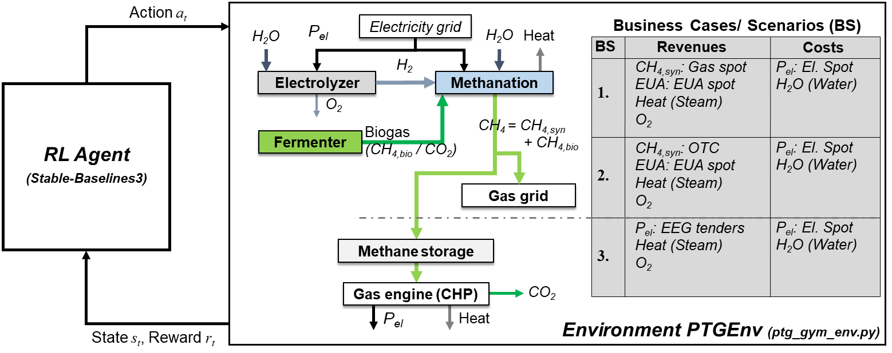

# RL_PtG

The **RL_PtG** project contains a framework for economic optimization of Power-to-Gas (PtG) dispatch using Deep Reinforcement Learning (RL). PtG is a technology for chemical energy storage of renewable energies in chemical energy carriers, such as hydrogen (H2) or methane (CH4). **RL_PtG** enables training state-of-the-art deep RL algorithms for optimal control of PtG plants depend on process data and Day-ahead electricity, natural gas, and emission spot market data. The present repository provides the source code for this application, which has been demonstrated successfully for autonomous control of a real-world PtG pilot plant in Northern Germany [1].


---

## Table of Contents

1. [Overview](#overview)
2. [Project structure](#structure)
3. [Installation and Usage](#installation)
4. [License](#license)
5. [Citing](#citing)
6. [References](#references)
7. [Acknowledgments](#acknowledgments)

---

## Overview

**RL_PtG** is written in Python and includes a data-based process model of a real-world PtG plant. The present section describes the application in more detail and elaborates on the algorithms, the data preprocessing, and feature design.

### Application

The first step in PtG is typically water electrolysis, which uses electrical current to split water (H2O) electrochemically into hydrogen and oxygen (O2). RL_PtG assumes a proton exchange membrane (PEM) electrolyzer with a load-depend efficiency of a commercial system [2]. The efficiency has been modelled using experimental data and linear regression with non-linear basis functions [3]. In addition to PEM electrolysis, RL_PtG incorporates a chemical methanation unit which converts hydrogen with carbon dioxide (CO2) into methane. Since biogas contains a large amount of CO2 (up to 50 %), the current process applies this carbon source. To model the process dynamics of the methanation unit, which dominates the overall PtG dynamics, the present approach incorporates a time-series process model based on experimental data of a real-world pilot plant. The experimental data contains plant transitions during startup, load changes, cooldown, and standby of the methanation unit. In standby, the reactor temperature is maintained at around 190 °C to enable a fast warm startup. The data-based process model switches between the different time-series data sets to predict the dynamic operation of the plant. Such an approach is simple and exhibits very low model-mismatch, if the plant behaves reproducible [3].
Fig. 1 portrays the current PtG process, which can either blend the produced CH4 into the natural gas grid or use it in a gas engine for combined heat and power (CHP) production. The different ways of processing and selling the produced CH4 lead to three different options for business scenario (BS) in the present application. While BS1 trades CH4 at the natural gas spot market, BS2 sells CH4 to a bilateral partner via Over-the-Counter contracts. By contrast, BS3 integrateds the CHP plant and sells the produced electrical power P_el in special tenders of the German renewable energy act (EEG). Other revenue types are heat, oxygen, and European emission allowances (EUA). Due to binding emissions (CO2) in methane, BS1 and 2 can sell EUAs at the European emission trading system (EU-ETS). The main operational costs of the process are electricity and water. The electrical power is bought at the German Day-ahead spot market. The 
RL_PtG integrates historical electricity market data in `data/spot_market_data/` provided by SMARD [4]. The original work and RL training in [1,3] uses historical market data for gas and EUA provided by MONTEL [5]. However, since RL_PtG has not permission for publishing gas and EUA spot market data, it includes a synthesized data sets which resemble the characteristics and non-linearity of the original ones. 
RL_PtG contains the PtG processs including PEM electrolysis, chemical methanation, and energy market data in the PtGEnv environment (*Gymnasium* environemt). [Project structure](#structure) provides an overview over all directories and files involved.



*Figure 1: Optimization framework for Power-to-Gas dispatch using Reinforcement Learning agents and the PtGEnv environment including the different business cases.*

### Deep RL algorithms

Deep RL is a promising approach for economic optimization of chemical plant operation with non-linearity and stochasticity in both process dynamics and market behavior. For deep RL, RL_PtG incorporates the *Stable-Baselines3* and *SB3 Contrib* libraries. These libraries contain implementations various state-of-the-art deep RL algorithms. The present project incorporates the DQN [6], A2C [7], PPO [8], TD3 [9], SAC [10], and TQC [11] algorithms based on the *Stable-Baselines3* and *SB3 Contrib* implementation. For more information on the implementation, refer to:
      Stable-Baselines3: https://stable-baselines3.readthedocs.io/en/master/guide/algos.html
      SB3 Contrib: https://sb3-contrib.readthedocs.io/en/master/
The algorithm configurations for a training run can be set in `config/config_agent.yaml`. Note that if you want to add another algorithm from the *Stable-Baselines3* or *SB3 Contrib* libraries. You need to adjust `config/config_agent.yaml` and `src/rl_config_agent.py` by analogy to the already implemented ones.

### Data preprocessing and feature design


potential rewards.
These represent the maximum possible reward in Power-to-Gas (PtG) operation, 
either in partial load [part_full_b... = 0] or full load [part_full_b... = 1].

---

## Project Structure

The project is organized into the following directories and files:

```plaintext
RL_PtG/
│
├── config/
│   ├── config_agent.yaml
│   ├── config_env.yaml
│   └── config_train.yaml
│
├── data/
│   ├── OP1/
│   ├── OP2/
│   └── spot_market_data/
│
├── env/
│   └── ptg_gym_env.py
│
├── logs/
│
├── plots/
│
├── src/
│   ├── rl_config_agent.py
│   ├── rl_config_env.py
│   ├── rl_config_train.py
│   ├── rl_opt.py
│   └── rl_utils.py
│
├── tensorboard/
│
├── requirements.txt
├── rl_main.py
└── rl_tb.py

```

### `config/`
Contains configuration files for the project:
- **`config/config_agent.yaml`**: Configuration for the RL agent.
- **`config/config_env.yaml`**: Configuration for PtG environment.
- **`config/config_train.yaml`**: Configuration for training procedure.

### `data/`
Contains process data for two load levels OP1 and OP2 with different dynamics and energy market data:
- **`data/OP.../data-meth_cooldown.csv`**: Cold startup data
- **`data/OP.../data-meth_op1_start_p.csv`**: Partial load after startup
- **`data/OP.../data-meth_op2_start_f.csv`**: Full load after startup
- **`data/OP.../data-meth_op3_p_f.csv`**: Partial to full load transition
- **`data/OP.../data-meth_op4_p_f_p_5.csv`**: Partial to full load and back after 5 min
- **`data/OP.../data-meth_op5_p_f_p_10.csv`**: Partial to full load and back after 10 min
- **`data/OP.../data-meth_op6_p_f_p_15.csv`**: Partial to full load and back after 15 min
- **`data/OP.../data-meth_op7_p_f_p_20.csv`**: Partial to full load and back after 20 min
- **`data/OP.../data-meth_op8_f_p.csv`**: Full to partial load transition
- **`data/OP.../data-meth_op9_f_p_f_5.csv`**: Full to partial load and back after 5 min
- **`data/OP.../data-meth_op10_f_p_f_10.csv`**: Full to partial load and back after 10 min
- **`data/OP.../data-meth_op11_f_p_f_15.csv`**: Full to partial load and back after 15 min
- **`data/OP.../data-meth_op12_f_p_f_20.csv`**: Full to partial load and back after 20 min
- **`data/OP.../data-meth_standby_down.csv`**: From operation to standby
- **`data/OP.../data-meth_standby_up.csv`**: # From idle state to standby
- **`data/OP.../data-meth_startup_cold.csv`**: Cold startup data
- **`data/OP.../data-meth_startup_hot.csv`**: Warm startup data
- **`data/OP.../data-meth_cooldown.csv`**: Cooldown data
- **`data/spot_market_data/data-day-ahead-el-test.csv`**: Day-ahead electricity spot market data for testing
- **`data/spot_market_data/data-day-ahead-el-train.csv`**: Day-ahead electricity spot market data for training
- **`data/spot_market_data/data-day-ahead-el-val.csv`**: Day-ahead electricity spot market data for validation
- **`data/spot_market_data/data-day-ahead-eua-test.csv`**: Day-ahead EUA spot market data for testing
- **`data/spot_market_data/data-day-ahead-eua-train.csv`**: Day-ahead EUA spot market data for training
- **`data/spot_market_data/data-day-ahead-eua-val.csv`**: Day-ahead EUA spot market data for validation
- **`data/spot_market_data/data-day-ahead-gas-test.csv`**: Day-ahead gas spot market data for testing
- **`data/spot_market_data/data-day-ahead-gas-train.csv`**: Day-ahead gas spot market data for training
- **`data/spot_market_data/data-day-ahead-gas-val.csv`**: Day-ahead gas spot market data for validation

### `env/`
Contains the PtG environment modelled as a *Gymnasium* class
- **`env/ptg_gym_env.py`**: The power to 

### `logs/`
During training, RL_PtG stores the algorithm and its parameters with the best performance in the validation environment in 'logs/'.

### `plots/`
After the training procedure, the best algorithm/ policy is evaluated on the test set and RL_PtG will create a diagram of its performance in 'plots/'.

### `src/`
Contains source code for pre- and postprocessing:
- **`src/rl_config_agent.py`**: Processing of the agent configuration
  - `AgentConfiguration()`: Class for preprocessing the agent's configuration.
    - `set_model()`: Specifies and initializes the Stable-Baselines3 model for RL training.
    - `load_model()`: Loads a pretrained Stable-Baselines3 model for RL training.
    - `save_model()`: Saves the trained Stable-Baselines3 model and its replay buffer (if applicable).
    - `get_hyper()`: Displays the algorithm's hyperparameters and creates a string identifier for file identification using `hyp_print()`. 
    - `hyp_print()`: Displays the value of a specific hyperparameter and adds it to the string identifier.
- **`src/rl_config_env.py`**: Processing of the environment configuration
  - `EnvConfiguration()`: Class for preprocessing the environment's configuration.
- **`src/rl_config_train.py`**: Processing of the training configuration
  - `TrainConfiguration()`: Class for preprocessing the training configuration.
- **`src/rl_opt.py`**: Computes the potential rewards, the load identifiers, and the theoretical optimum T-OPT ignoring plant dynamics.
  - `calculate_optimum()`: Computes the theoretical maximum revenue for the Power-to-Gas process, assuming no operational constraints.          
- **`src/rl_utils.py`**: Contains utiliy and helper functions
  - `import_market_data()`: Imports day-ahead market price data.
  - `import_data()`: Imports experimental methanation process data.
  - `load_data()`: Loads historical market data and experimental methanation operation data using `import_market_data()` and `import_data()`
  - `Preprocessing()`: A class for preprocessing energy market and process data
    - `preprocessing_rew()`: Data preprocessing, including the calculation of potential rewards using `calculate_optimum()`
    - `preprocessing_array()`: Convert dictionaries to NumPy arrays for computational efficiency
    - `define_episodes()`: Defines settings for training and evaluation episodes using `rand_eps_ind()`
    - `rand_eps_ind()`: Generate a randomized selection of subsets from the whole training data set without replacement
    - `dict_env_kwargs()`: Attributes global model parameters and hyperparameters to a kwargs dictionary for the PtG environment
    - `initial_print()`: Displays initial information to the text user interface
    - `config_print()`: Gathers and prints general settings
    - `_make_env()`: Helper function to create and normalized environments
    - `eval_callback_dec()`: Decorator to create an evaluation environment and its EvalCallback
    - `_make_eval_env()`: Creates an evaluation using `_make_env()` and `eval_callback_dec()`
    - `create_vec_envs()`: Creates vectorized environments for training, validation, and testing using `_make_eval_env()` and `_make_env()`
  - `Postprocessing()`: A class for post-processing
    - `test_performance()`: Test RL policy on the test environment 
    - `plot_results()`: Generates a plot displaying test results

### `tensorboard/`
During RL training, RL_PtG will store a tensorboard file for monitoring.

### Main Script
- **`rl_main.py`**: The main script for training the predefined RL agent on the PtG dispatch task.
  - `computational_resources()`: Configures computational resources
  - `check_env()`: Registers the Gymnasium environment if it is not already in the registry
  - `main()`: Initiates and performs model training and evaluation

### Miscellaneous
- **`rl_tb.py`**: Starts the tensorboard server for monitoring of RL training results.
- **`requirements.txt`**: Contains the required python libraries.

---

## Installation and Usage

The following steps describe the installation procedure:

```bash
# Clone the repository
git clone https://github.com/SimMarkt/RL_PtG.git

# Navigate to the project directory
cd RL_PtG

# Create a Python virtual environment
python -m venv venv

# Activate the virtual environment
.\venv\Scripts\activate

# Install the required python libraries
pip install -r requirements.txt

```

Note that Python 3.10 or a newer Version is required to run the code. After installing the python environment with its necessary packages, the configuration of the environment, the agent, and the training procedure can be adjusted using the yaml files in `config/`. The RL training can initiated by running the main script `rl_main.py`.
During the training process, the RL performance will frequently be evaluated on the validation environemt with new and unkown energy market data. The best algorithm will further be saved in `logs/`. In addition, the training results (cumulative reward on the training and validation sets, and agorithm specific properties) are stored in a tensorboard file in `tensorboard/`.  The training and evaluation results can be viewed and monitored by starting the tensorboard server using `rl_tb.py` and the URL `http://localhost:6006/`. Fig. 2 displays the visualization of a learning curve while training a PPO algorithm on the PtG dispatch optimization task. 


*Figure 2: Graphical user interface of the tensorboard server for RL monitoring with a learning curve of PPO on the validation environment.*

After the RL training, RL_PtG picks the best algorithm from `logs/` and evaluates its performance on the test environment to examine its ability to generalize well. The results are plotted and stored in `plots/` (Fig. 3). The file name and title indicates the applied business scenario (BS), load level (OP), state feature design (sf), training episode length (ep), time-step size (ts), algorithm, and the algorithm hyperparameters, such as learning rate (al), discount factor (ga), and entropy coefficient (ec), exploration noise (en), n-step TD update (ns), n-step factor (nf), replay buffer size (rb), batch size (bs), No. of hidden layers (hl), No. of hidden units, activation function (ac), generalized advantage estimation (ge), No. of epochs (ep), normalize advantage (na), No. of quantiles (nq), No. of dropped quantiles (dq), No. of critics (cr), soft update parameter (ta), learning starts (ls), training frequency (tf), target update interval (tu), and gSDE exploration (gs).


*Figure 3: PPO performance on the test environment including energy market data, PtG process state, methane production, reward, and cumulative reward.*

---

## License

This project is licensed under [MIT License](LICENSE).

---

## Citing

If you use RL_PtG in your research please use the following BibTeX entry:
```BibTeX
@misc{SimMarkRLPtG,
  author = {Markthaler, Simon},
  title = {RL_PtG: Deep Reinforcement Learning for Power-to-Gas dispatch optimization},
  year = {2024},
  url = {https://github.com/SimMarkt/RL_PtG}
}
```

---

## References

DQN [6], A2C [7], PPO [8], TD3 [9], SAC [6], and TQC [10]

[1] Markthaler S., "*Katalytische Direktmethanisierung von Biogas: Demonstration
in industrieller Umgebung und Betriebsoptimierung mittels Reinforcement
Learning*", DECHEMA Jahrestreffen der Fachsektion Energie, Chemie
und Klima (11.-12.03.), Frankfurt/Main, 2024

[2] M. Kopp, D. Coleman, C. Stiller, K. Scheffer, J. Aichinger, B. Scheppat, "*“Energiepark
Mainz: Technical and economic analysis of the worldwide largest
Power-to-Gas plant with PEM electrolysis*", International Journal of Hydrogen Energy,
42, 2017, 13311–13320

[3] Markthaler S., "*Optimization of Power-to-Gas operation and dispatch using Deep Reinforcement Learning*", Dissertation (PhD Thesis), Friedrich-Alexander-Universität Erlangen-Nürnberg, 2025 (not yet been published).

[4] Bundesnetzagentur, "*SMARD - Strommarktdaten, Stromhandel und Stromerzeugung in Deutschland*", https://www.smard.de/home (Accessed, 15.08.2024)

[5] Montel AS., "*Montel Online Platform*", https://www.montelnews.com/ (Accessed, 26.07.2023)

[6] V. Mnih, K. Kavukcuoglu, D. Silver, A. A. Rusu, J. Veness, M. G. Bellemare, A. Graves, M. Riedmiller, A. K. Fidjeland, G. Ostrovski, S. Petersen, C. Beattie, A. Sadik, I. Antonoglou, H. King, D. Kumaran, D. Wierstra, S. Legg, D. Hassabis,
"*Human-level control through deep reinforcement learning*", Nature, 518, 2015, 529–533

[7] V. Mnih, A. P. Badia, M. Mirza, A. Graves, T. P. Lillicrap, T. Harley, D. Silver, K. Kavukcuoglu, "*Asynchronous Methods for Deep Reinforcement Learning*",
arXiv preprint arXiv:1602.01783, 2016, 1–19

[8] J. Schulman, F. Wolski, P. Dhariwal, A. Radford, O. Klimov, "*Proximal Policy Optimization Algorithms*", arXiv preprint arXiv:1707.06347, 2017, 1–12

[9] S. Fujimoto, H. van Hoof, D. Meger, "*Addressing Function Approximation Error in Actor-Critic Methods*", arXiv preprint arXiv:1802.09477, 2018, 1–15

[10] T. Haarnoja, A. Zhou, K. Hartikainen, G. Tucker, S. Ha, J. Tan, V. Kumar, H. Zhu, A. Gupta, P. Abbeel, S. Levine, "*Soft Actor-Critic Algorithms and Applications*", arXiv preprint arXiv:1812.05905, 2019, 1–17

[11] A. Kuznetsov, P. Shvechikov, A. Grishin, D. Vetrov, "*Controlling Overestimation Bias with Truncated Mixture of Continuous Distributional Quantile Critics*", arXiv preprint arXiv:2005.04269, 2020, 1–17


---

## Acknowledgments

This project was funded by the German *Federal Ministry for Economic Affairs and Climate Action* within the **Power-to-Biogas**
project (Project ID: 03KB165). 

---