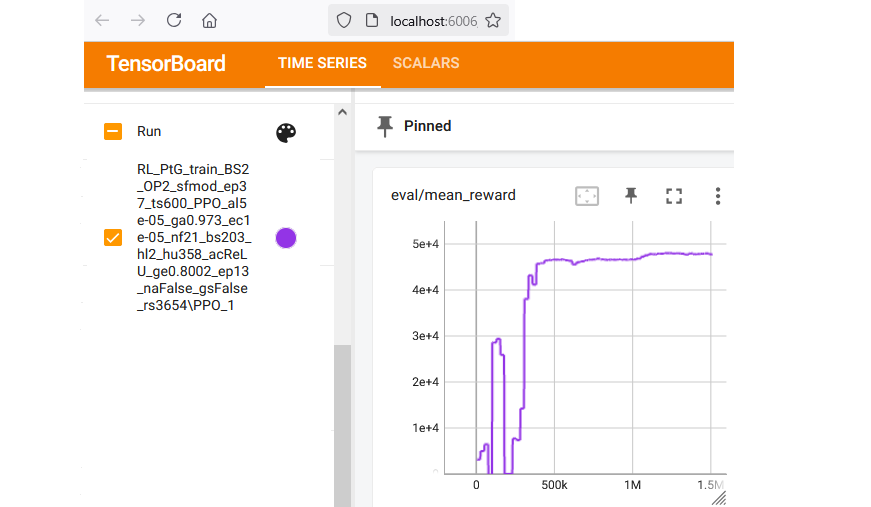

# RL_PtG

Deep Reinforcement Learning (RL) for dynamic Real-time optimization of Power-to-Gas (PtG) dispatch with respect to Day-ahead electricity, natural gas, and emission allowances market data. The PtG process comprises a proton exchange membrane electrolyzer (PEMEL) and a chemical methanation unit.


---

## Table of Contents

1. [Overview](#overview)
2. [Project structure](#structure)
3. [Installation and Usage](#installation)
4. [License](#license)
5. [Citing](#citing)
6. [Acknowledgments](#acknowledgments)

---

## Overview

**RL_PtG** is ... 

### Application
Deep RL is a promising approach for economic optimization of chemical plant operation. This python project implements deep RL for PtG dispatch optimization under Day-ahead energy
market conditions. The file "rl_main.py" contains the for training RL agents using a "data-based process model" of PtG as environment. This model has been derived from experimental data of a real PtG demonstration plant and serve as environment, along with energy market data.
The environment has been implemented using the Gymnasium environment.
With regard to RL, the project incorporates six state-of-the-art RL algorithms (DQN, A2C, PPO, TD3, SAC, TQC) from Stable-Baselines3 library.

To configure the code, the project provides two YAML files in "./config": config_agent.yaml (for the RL agents) and config_env.yaml (for the environment)

The experimental process data and energy market data are present in "./data".
Note that two different load levels are ...


*Figure 1: Optimization framework for Power-to-Gas dispatch using Reinforcement Learning agents and the PtGEnv environment including the different business cases.*

For more information on the data-based process model, please refer to ...

- Data: Electricity price day-ahead data from SMARD; Since the main study used gas and EUA market data provided by MONTEL without the rights to publish. Create synthesized data based on the real market data using TimeGAN algorithm.

### Deep RL algorithms
... 

### Data preprocessing and feature design

potential rewards.
These represent the maximum possible reward in Power-to-Gas (PtG) operation, 
either in partial load [part_full_b... = 0] or full load [part_full_b... = 1].

---

## Project Structure

The project is organized into the following directories and files:

```plaintext
RL_PtG/
│
├── config/
│   ├── config_agent.yaml
│   ├── config_env.yaml
│   └── config_train.yaml
│
├── data/
│   ├── OP1/
│   ├── OP2/
│   └── spot_market_data/
│
├── env/
│   └── ptg_gym_env.py
│
├── logs/
│
├── plots/
│
├── src/
│   ├── rl_config_agent.py
│   ├── rl_config_env.py
│   ├── rl_config_train.py
│   ├── rl_opt.py
│   └── rl_utils.py
│
├── tensorboard/
│
├── requirements.txt
├── rl_main.py
└── rl_tb.py

```

### `config/`
Contains configuration files for the project:
- **`config/config_agent.yaml`**: Configuration for the RL agent.
- **`config/config_env.yaml`**: Configuration for PtG environment.
- **`config/config_train.yaml`**: Configuration for training procedure.

### `data/`
Contains process data for two load levels OP1 and OP2 with different dynamics and energy market data:
- **`data/OP.../data-meth_cooldown.csv`**: Cold startup data
- **`data/OP.../data-meth_op1_start_p.csv`**: Partial load after startup
- **`data/OP.../data-meth_op2_start_f.csv`**: Full load after startup
- **`data/OP.../data-meth_op3_p_f.csv`**: Partial to full load transition
- **`data/OP.../data-meth_op4_p_f_p_5.csv`**: Partial to full load and back after 5 min
- **`data/OP.../data-meth_op5_p_f_p_10.csv`**: Partial to full load and back after 10 min
- **`data/OP.../data-meth_op6_p_f_p_15.csv`**: Partial to full load and back after 15 min
- **`data/OP.../data-meth_op7_p_f_p_20.csv`**: Partial to full load and back after 20 min
- **`data/OP.../data-meth_op8_f_p.csv`**: Full to partial load transition
- **`data/OP.../data-meth_op9_f_p_f_5.csv`**: Full to partial load and back after 5 min
- **`data/OP.../data-meth_op10_f_p_f_10.csv`**: Full to partial load and back after 10 min
- **`data/OP.../data-meth_op11_f_p_f_15.csv`**: Full to partial load and back after 15 min
- **`data/OP.../data-meth_op12_f_p_f_20.csv`**: Full to partial load and back after 20 min
- **`data/OP.../data-meth_standby_down.csv`**: From operation to standby
- **`data/OP.../data-meth_standby_up.csv`**: # From idle state to standby
- **`data/OP.../data-meth_startup_cold.csv`**: Cold startup data
- **`data/OP.../data-meth_startup_hot.csv`**: Warm startup data
- **`data/OP.../data-meth_cooldown.csv`**: Cooldown data
- **`data/spot_market_data/data-day-ahead-el-test.csv`**: Day-ahead electricity spot market data for testing
- **`data/spot_market_data/data-day-ahead-el-train.csv`**: Day-ahead electricity spot market data for training
- **`data/spot_market_data/data-day-ahead-el-val.csv`**: Day-ahead electricity spot market data for validation
- **`data/spot_market_data/data-day-ahead-eua-test.csv`**: Day-ahead EUA spot market data for testing
- **`data/spot_market_data/data-day-ahead-eua-train.csv`**: Day-ahead EUA spot market data for training
- **`data/spot_market_data/data-day-ahead-eua-val.csv`**: Day-ahead EUA spot market data for validation
- **`data/spot_market_data/data-day-ahead-gas-test.csv`**: Day-ahead gas spot market data for testing
- **`data/spot_market_data/data-day-ahead-gas-train.csv`**: Day-ahead gas spot market data for training
- **`data/spot_market_data/data-day-ahead-gas-val.csv`**: Day-ahead gas spot market data for validation

### `env/`
Contains the PtG environment modelled as a *Gymnasium* class
- **`env/ptg_gym_env.py`**: The power to 

### `logs/`
During training, RL_PtG stores the algorithm and its parameters with the best performance in the validation environment in 'logs/'.

### `plots/`
After the training procedure, the best algorithm/ policy is evaluated on the test set and RL_PtG will create a diagram of its performance in 'plots/'.

### `src/`
Contains source code for pre- and postprocessing:
- **`src/rl_config_agent.py`**: Processing of the agent configuration
  - `AgentConfiguration()`: Class for preprocessing the agent's configuration.
    - `set_model()`: Specifies and initializes the Stable-Baselines3 model for RL training.
    - `load_model()`: Loads a pretrained Stable-Baselines3 model for RL training.
    - `save_model()`: Saves the trained Stable-Baselines3 model and its replay buffer (if applicable).
    - `get_hyper()`: Displays the algorithm's hyperparameters and creates a string identifier for file identification using `hyp_print()`. 
    - `hyp_print()`: Displays the value of a specific hyperparameter and adds it to the string identifier.
- **`src/rl_config_env.py`**: Processing of the environment configuration
  - `EnvConfiguration()`: Class for preprocessing the environment's configuration.
- **`src/rl_config_train.py`**: Processing of the training configuration
  - `TrainConfiguration()`: Class for preprocessing the training configuration.
- **`src/rl_opt.py`**: Computes the potential rewards, the load identifiers, and the theoretical optimum T-OPT ignoring plant dynamics.
  - `calculate_optimum()`: Computes the theoretical maximum revenue for the Power-to-Gas process, assuming no operational constraints.          
- **`src/rl_utils.py`**: Contains utiliy and helper functions
  - `import_market_data()`: Imports day-ahead market price data.
  - `import_data()`: Imports experimental methanation process data.
  - `load_data()`: Loads historical market data and experimental methanation operation data using `import_market_data()` and `import_data()`
  - `Preprocessing()`: A class for preprocessing energy market and process data
    - `preprocessing_rew()`: Data preprocessing, including the calculation of potential rewards using `calculate_optimum()`
    - `preprocessing_array()`: Convert dictionaries to NumPy arrays for computational efficiency
    - `define_episodes()`: Defines settings for training and evaluation episodes using `rand_eps_ind()`
    - `rand_eps_ind()`: Generate a randomized selection of subsets from the whole training data set without replacement
    - `dict_env_kwargs()`: Attributes global model parameters and hyperparameters to a kwargs dictionary for the PtG environment
    - `initial_print()`: Displays initial information to the text user interface
    - `config_print()`: Gathers and prints general settings
    - `_make_env()`: Helper function to create and normalized environments
    - `eval_callback_dec()`: Decorator to create an evaluation environment and its EvalCallback
    - `_make_eval_env()`: Creates an evaluation using `_make_env()` and `eval_callback_dec()`
    - `create_vec_envs()`: Creates vectorized environments for training, validation, and testing using `_make_eval_env()` and `_make_env()`
  - `Postprocessing()`: A class for post-processing
    - `test_performance()`: Test RL policy on the test environment 
    - `plot_results()`: Generates a plot displaying test results

### `tensorboard/`
During RL training, RL_PtG will store a tensorboard file for monitoring.

### Main Script
- **`rl_main.py`**: The main script for training the predefined RL agent on the PtG dispatch task.
  - `computational_resources()`: Configures computational resources
  - `check_env()`: Registers the Gymnasium environment if it is not already in the registry
  - `main()`: Initiates and performs model training and evaluation

### Miscellaneous
- **`rl_tb.py`**: Starts the tensorboard server for monitoring of RL training results.
- **`requirements.txt`**: Contains the required python libraries.

---

## Installation and Usage

Detailed steps to set up the project on a local environment:

```bash
# Clone the repository
git clone https://github.com/SimMarkt/RL_PtG.git

# Navigate to the project directory
cd RL_PtG

# Create a Python virtual environment
python -m venv venv

# Activate the virtual environment
.\venv\Scripts\activate

# Install the required python libraries
pip install -r requirements.txt

```

Afterwards, create a new Python virtual environment in the project folder and install the packages in the requirements.txt.
Note that Python 3.10 or a newer Version is required to run the code.
After installing all Python packages, the code can be run by using the rl_main_TQC_hpc.py file.



*Figure 2: Graphical user interface of the tensorboard server for RL monitoring with a learning curve of PPO on the validation environment.*


*Figure 3: PPO performance on the test environment including energy market data, PtG process state, methane production, reward, and cumulative reward.*


---

## License

This project is licensed under [MIT License](LICENSE).

---

## Citing

If you use RL_PtG in your research please use the following BibTeX entry:
```BibTeX
@misc{SimMarkRLPtG,
  author = {Markthaler, Simon},
  title = {RL_PtG: Deep Reinforcement Learning for Power-to-Gas dispatch optimization},
  year = {2024},
  url = {https://github.com/SimMarkt/RL_PtG}
}
```

For more information, please refer to:

Markthaler S., "*Optimization of Power-to-Gas operation and dispatch using Deep Reinforcement Learning*", Dissertation (PhD Thesis), Friedrich-Alexander-Universität Erlangen-Nürnberg, 2025 (not yet been published).

---

## Acknowledgments

This project was funded by the German *Federal Ministry for Economic Affairs and Climate Action* within the **Power-to-Biogas**
project (Project ID: 03KB165). 

---